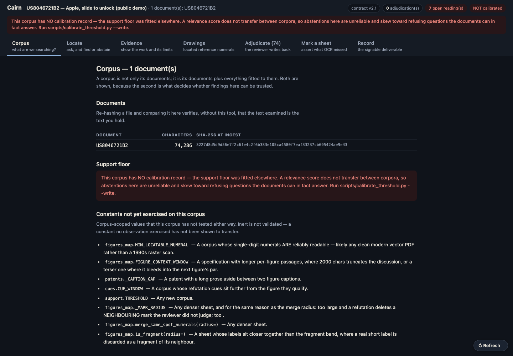
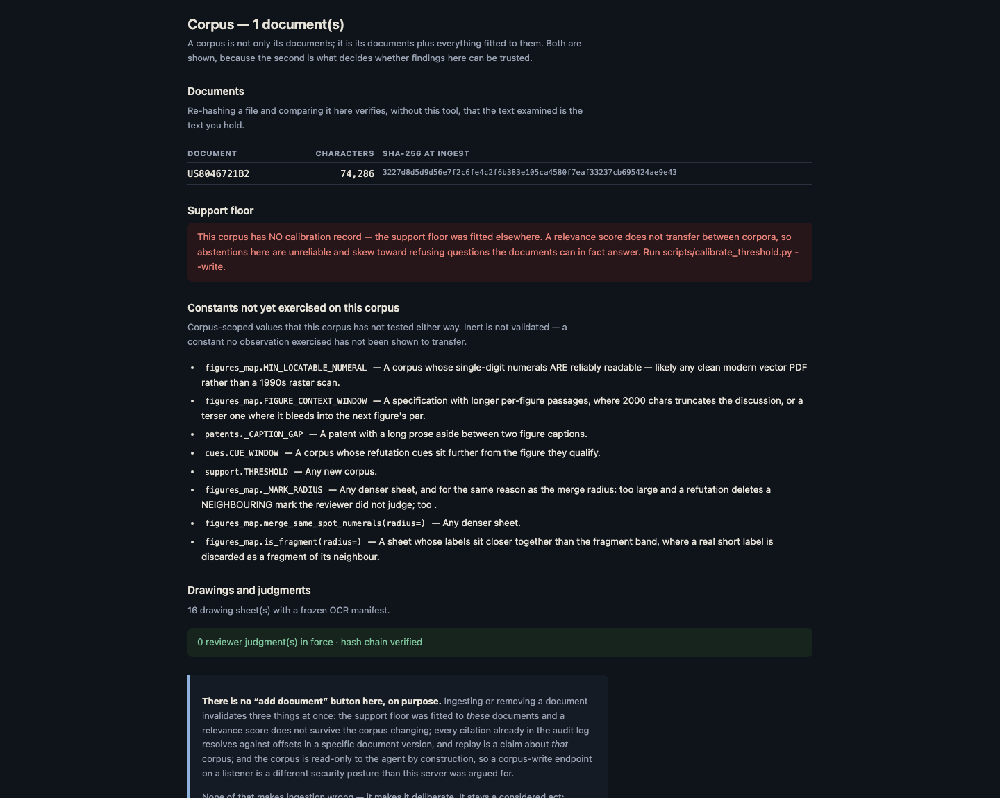
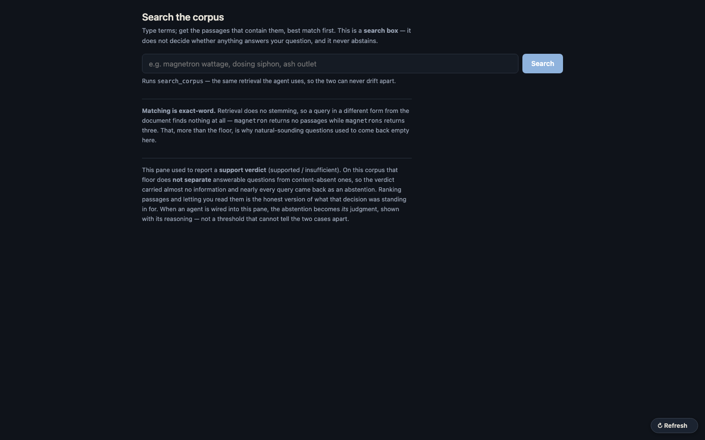
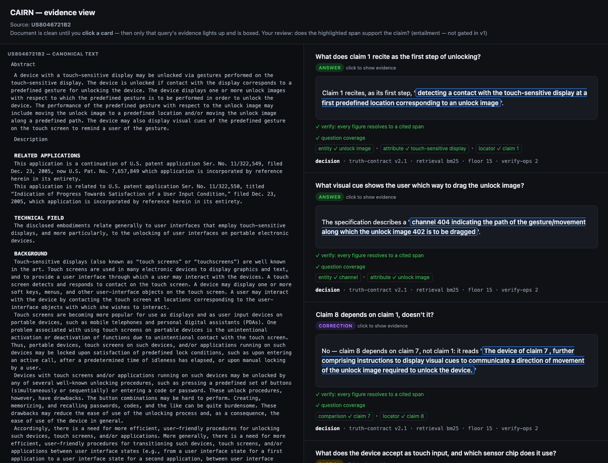
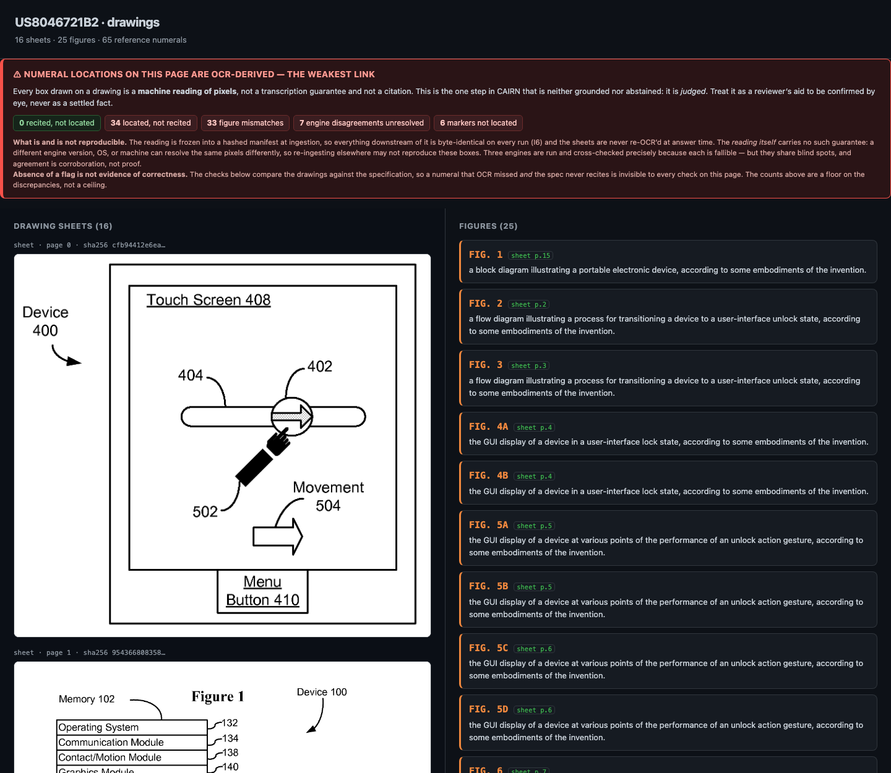
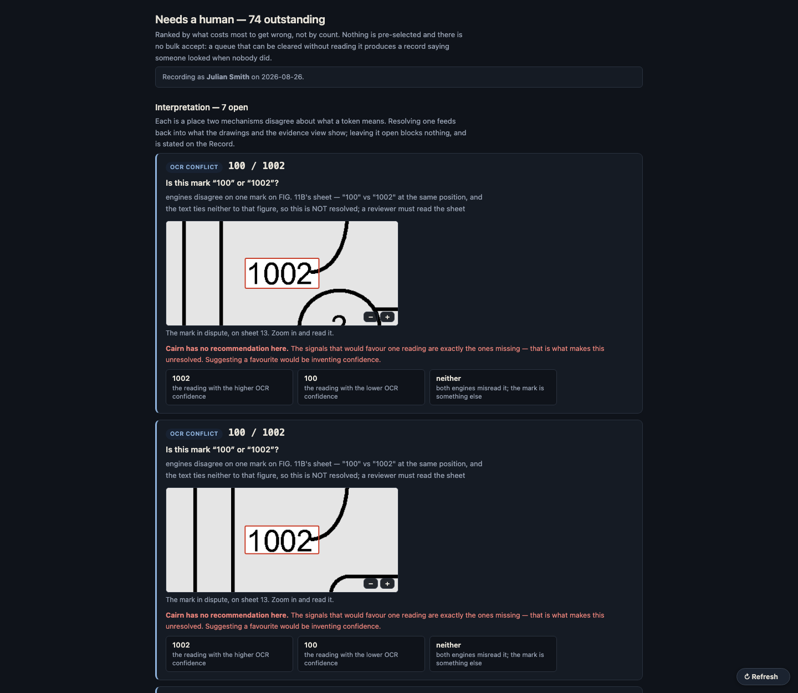
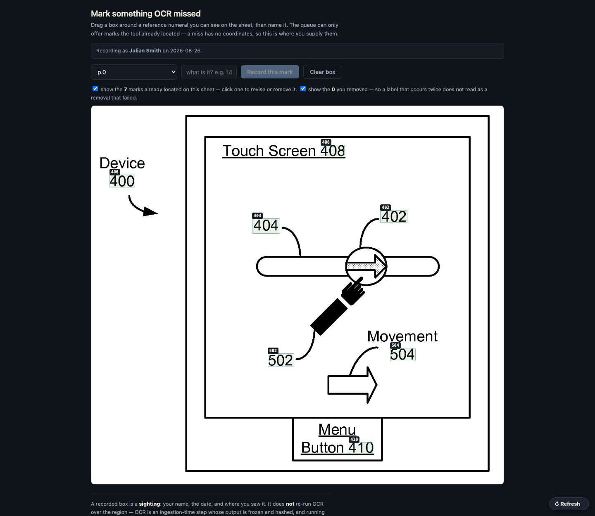
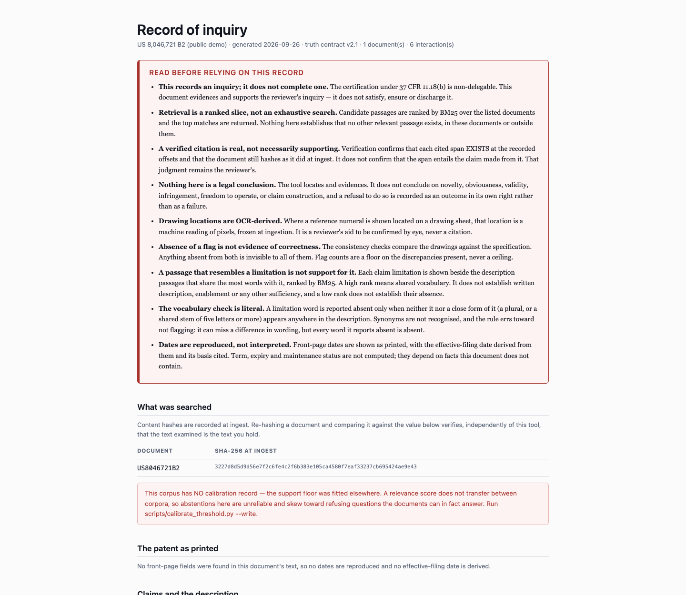

# CAIRN

> *An AI agent that answers questions and runs tasks over your documents where every claim is traceable to its source, it refuses to answer when the evidence isn't there, and a test suite proves it.*

Cairn — *a marker built so a place can be found again by someone who wasn't there* — is a
grounded-retrieval system whose
cardinal rule is **ground or abstain — never invent.** Every assertion it makes is bound
to a verifiable source span, or it is not made; where the evidence isn't there, it returns
a structured refusal instead of a guess.

> **New here? Start with the illustrated tour:** [`docs/system_overview.html`](docs/system_overview.html)
> — and see [`artifacts/`](artifacts/) for the product roadmap and a sample deliverable.
> — how the mechanisms actually work (the AI/deterministic split, the data model, the loop,
> the five outcomes, what `verify` does, the audit chain, and the two eval layers), diagram-first
> and readable without touching the code.

## What v1 actually guarantees

The honest, defensible claim — and it is deliberately precise:

> *Every citation points to real, verbatim, uniquely-resolvable source text, and the
> system provably abstains when retrieval finds nothing.*

That is stronger in practice than a vague "no hallucinations," because it is a promise that
can be kept and tested. The split between what is **guaranteed** and what is **measured**:

| | Deterministic — CAIRN guarantees it at runtime | A model judgment — measured offline, not enforced at runtime in v1 |
|---|---|---|
| **What** | Span resolution (quote exists verbatim, exactly once, hash-matched), retrieval, abstention *trigger* | **Entailment** — does the cited span actually *support* the claim? |
| **How** | String + hash ops, seeded; CI-gated | Scored by the eval judge (LLM-as-judge); the v2/API design pulls it inline |

So "verified" means a citation **exists and is real** — not that it *supports* the claim.
Entailment quality is a measured score, foregrounded in the eval harness, not an overclaim.

## See it run

A guided, dependency-free walkthrough over Apple's FY2024 10-K — grounded answers
with their verbatim source spans, and structured refusals that show the system
looked and where:

```bash
python demo.py                       # narrated tour of seven representative questions
python cairn_rig.py                 # the full 20-item gate: precision, hallucination, abstention
python scripts/build_evidence_view.py && open evidence_view.html   # the GUI
```

For the whole review surface in one frame — seven stages, from corpus to signable
record — build the **console** instead; see [the tour below](#the-console--a-tour).

`evidence_view.html` is a self-contained, server-less **parallel evidence view**
(ROADMAP M2-T7): the **full canonical document** on the left with every cited range
highlighted in place, and the interactions on the right — grounded answers,
derived values, plural answers, abstentions, false-premise rejection, and
per-answer question-coverage. **Click a figure to scroll the document to its
highlight.** Your review job is the one thing v1 doesn't gate: does the
highlighted span actually *support* the claim?

These scripts run with **plain `python` from the repo root — no install needed**
(they put `src/` on the path themselves). For the dev loop (tests + lint) install
the package: `pip install -e ".[dev]"`, then `pytest -m layer0`.

The demo needs no install (pure standard library). It exercises the M0 audition
rig — the deterministic evidence layer (retrieval → cite → verify → abstain). At
M2+ the Claude Code agent drafts the prose, calling these same tools; the demo's
abstention guards are documented stand-ins for the agent's reasoning until then.

## Runtime model — v1 is a Claude Code tool, not an API service

CAIRN ships as a set of **deterministic tools** (an MCP server + a CLI mirror) that
**Claude Code invokes during a session**. The reasoner *is* the Claude Code agent; CAIRN
makes **no model calls of its own** at runtime. The agent composes prose from returned
spans; CAIRN provides the deterministic machinery plus a mandatory **verify + log** step
the agent is bound to call before presenting an answer.

Because the agent sits *above* CAIRN and calls it, CAIRN cannot structurally intercept the
agent's free text (as the deferred v2/API design would). The guarantee instead comes from
(a) deterministic tools and (b) the verify-and-log step — an honest weakening, and the
reason the eval harness measures end-to-end compliance.

The only place a model-as-judge appears is the **Layer-E eval harness**, isolated there.

## Invariants

Non-negotiable; each maps to a test in the oracle. A PR that violates one does not merge.

- **I1 — Span-level provenance.** Every asserted claim carries a verifiable pointer (`doc_id`, `char_start`, `char_end`) to a source span.
- **I2 — Abstention over fabrication.** When evidence doesn't clear threshold, emit a structured refusal, not an answer.
- **I3 — Verified immutability of source.** Documents are content-hashed at ingest; spans reference immutable offsets; any drift is a hard failure.
- **I4 — Read/write asymmetry.** The corpus is read-only to the agent. The only writable surface is the append-only audit log.
- **I5 — Append-only audit log.** Every query, retrieval set, answer, citation set, abstention, and confidence is logged immutably and replayably.
- **I6 — Deterministic evidence layer.** Same corpus + query → reproducible retrieval and span-mapping (seeded). CAIRN makes no runtime model calls, so every tool is a pure deterministic function.

## The MCP surface

The MCP server (and a CLI mirror) is the **only** interface in v1. There is no
`answer_with_citations` tool — composition is the agent's job — so the tools decompose into
*retrieve → (agent drafts) → verify → log*. Read/write asymmetry (I4) is enforced here: the read tools hold no reference to a log, so
a read handler cannot append even by mistake.

Tool **metadata is a trust surface, not documentation** — an agent reads descriptions and
acts on them — so the whole advertised surface (names, descriptions, schemas) is hashed and
pinned by a standing test, descriptions are linted for instruction-like language, and every
input is bounded rather than merely typed (D41).

| Tool | Purpose | Side effects |
|---|---|---|
| `search_corpus(query)` | Ranked candidate spans | none (read) |
| `lint_question(question)` | Flags a question against this corpus *before* it runs — absent terms, a unit the document lacks, a request for a legal conclusion, two questions in one. Advisory: flags, never rewrites | none (read) |
| `get_span(doc_id, start, end)` | Fetch + hash-verify a span | none (read) |
| `get_document(doc_id)` | Full hash-verified text — read freely (D11) | none (read) |
| `check_support(question)` | Supporting spans or `insufficient` — the abstention decision | append to log |
| `verify(answer_with_tags)` | Confirms every cited span resolves + hash-matches; flags unbound claims | append to log |
| `check_claim(claim)` | Resolve a *user-supplied* claim to supporting spans (or none) | append to log |

## Working with a corpus it was not fitted to

Every extraction constant in Cairn was fitted to **one** corpus, and each was found the
same way: a human noticed a miss. Two capabilities exist because pretending otherwise is
the failure mode.

**The support floor travels with its corpus.** `check_support`'s threshold is a BM25 score,
which does not transfer between corpora — it scales with document length and term
distribution — and it fails toward **false abstention**, the direction that looks like
diligence. Measured: a question that was the entire subject of a second patent scored 4.56
against a floor of 15.0 fitted on EDGAR, so the system refused an answerable question. A
store now carries a calibration record, and every result reports whether the floor is
*calibrated*, *stale*, *uncalibrated*, or an *explicit override* — including on the
client-facing report.

**Fitted constants carry their own falsifiers.** `src/cairn/corpus_fit.py` registers each
one with the evidence that set it and the observation that would show it does not transfer;
a standing test fails if a value is retuned without updating its provenance, or if a new
tunable appears unregistered. The procedure for pointing Cairn at a new corpus is
[`docs/corpus_fitting.md`](docs/corpus_fitting.md), and the first end-to-end run of it is
written up in [`docs/corpus_fit_record_US8046721B2.md`](docs/corpus_fit_record_US8046721B2.md)
— eight defects found on a system passing its whole gate, all of them in *ingestion*.

## The reviewer writes back

Cairn supports a professional's judgment, so that judgment has to be able to enter the
record — and survive. Reviewers **confirm**, **refute**, **correct** or **note**, and each
judgment is appended to a hash-chained log with who and when. There is no update and no
delete: a revision appends and names what it supersedes, and the earlier call stays
legible. A machine writer **cannot** displace a human judgment; it may only record a
disagreement, which is itself evidence.

```bash
python scripts/adjudicate.py --store <store> --id fig2-A --confirm \
    --page 3 --numeral A --x 0.84 --y 0.19 --by "A. Reviewer" --on 2026-07-28
python scripts/adjudicate.py --store <store> --list      # incl. superseded entries
```

This exists because the previous design — a mutable JSON array — lost one. A reviewer's
confirmation was overwritten by a machine read and is unrecoverable.

## The deliverable

What a client buys is not the answer. Under 37 CFR 11.18(b) a practitioner's certification
is **non-delegable**, so the sellable artifact is the **record of the inquiry**: what was
searched (with hashes anyone can re-verify), what each question resolved to, what was cited
at which offsets, **what was surfaced and set aside**, and under exactly what declared
limits — which are printed before any finding.

```bash
python scripts/build_review_report.py --store <store> --audit <log> \
    --on YYYY-MM-DD --out record.html
```

A sample is in [`artifacts/`](artifacts/). Its wording is tested as behaviour: the report
says it *evidences* and *supports* an inquiry and never that it *satisfies* or *discharges*
one, and it states plainly that retrieval is a ranked slice rather than an exhaustive
search.

## The eval harness (the hero)

The oracle splits along the runtime boundary:

- **Layer 0 — deterministic component evals** (block every push; fast, stable — 271 tests in ~3s, no model calls). Span resolution 1:1, citation integrity (I3), retrieval recall + reproducibility (I6), abstention trigger on content-absent items, `verify` rejects planted ungrounded claims, plural-and-ranked, the golden-set freeze, the corpus-fit registry, the tool-manifest hash, and the append-only adjudication chain. The gate table is [`docs/layer0_gate.md`](docs/layer0_gate.md); run it with `pytest -m layer0`.
- **Layer E — agent end-to-end evals** (periodic, via headless Claude Code; non-blocking). Hallucination/entailment via LLM-as-judge, citation precision/recall, answer correctness, abstention correctness, and abstention **calibration** (Brier + reliability curve). It also grades the **citation, not just the verdict**: a scorer that only checks whether the system presented is measuring the verdict and not the provenance, so `evidence_accuracy` is reported alongside `decision_accuracy` and the **gap between them is published rather than smoothed** (RT-8).

## Corpus

v1 reference corpus is **SEC EDGAR 10-K / 10-Q filings** (free, public, high-stakes, shareable
demo). The seed golden set ([`golden_seed.json`](golden_seed.json)) ships 20 hand-labeled
items grounded in Apple's FY2024 10-K, with a deliberate unanswerable fraction. The
corpus-specific adapter is isolated to the ingestion module — a corpus swap touches one file.

## The console — a tour

Every screenshot below is a real build over **US 8,046,721 B2** (Apple, *"Unlocking a
device by performing gestures on an unlock image"* — the slide-to-unlock patent). It is
used here because it is **public**: the live client engagement never leaves the machine
it is reviewed on, so the pictures in a public repo have to come from a document anyone
can pull from USPTO.

Build and serve it yourself:

```bash
python scripts/build_console.py --store <store> --audit <audit.jsonl> --doc <DOC_ID> \
    --on $(date +%F) --reviewer "Your Name" --out console/
python scripts/serve_console.py --store <store> --audit <audit.jsonl> --dir console/ \
    --reviewer "Your Name" --open
```

The server is **loopback-only and refuses to bind anything else**; it exists so the
pages can call the *real* retrieval rather than a second implementation in JavaScript
that could drift from it.

### One frame, seven stages



The header carries what every pane below it depends on: the corpus, the contract
version, the judgment count, and the calibration state. Here it reads **NOT calibrated**
in red — the support floor was fitted to a different corpus, so abstentions on this one
are unreliable. That warning is the point: a tool that hid it would be more comfortable
and less honest.

### Corpus — what are we searching?



The documents with their **SHA-256 at ingest**, so you can re-hash a file yourself and
confirm — without trusting this tool — that the text examined is the text you hold. Below
that, the constants this corpus has never exercised: values fitted elsewhere that no
observation here has tested. Inert is not validated.

### Locate — a search box, not an oracle



Ranked passages, best match first. It does not decide whether anything answers your
question and it never abstains. Before searching it **lints the question** and says what
will not work: words no passage contains, a claim the document does not have, a request
for a legal conclusion, two questions in one. It flags; it never rewrites, because the
question as asked is what gets answered and recorded.

### Evidence — the work and its limits



The full canonical document on the left, the interactions on the right. Click a card and
only that interaction's evidence lights up. Each card shows its outcome class, whether
every figure resolved to a cited span, and whether the citation **covers the question's
constraints** — including `locator ✓ claim 1`, which is checked by position rather than
by text, because a claim never names itself.

Answers whose citations no longer resolve are **withheld**, not annotated: an
unresolvable offset would paint a box around unrelated text and lend it the authority of
a citation.

### Drawings — located reference numerals



Sheets beside the specification's own numeral legend, discrepancies first. Every location
is **OCR-derived** — a machine reading of pixels, frozen at ingest, offered as a
reviewer's aid and never as a citation.

### Adjudicate — the reviewer writes back



Two queues. **Interpretation** asks which reading was meant — is this token a part number
or a measurement, is this mark a 12 or a 72 — showing the evidence on both sides and a
recommendation that is labelled a recommendation. Where the deterministic signals favour
neither reading, it says so rather than inventing a favourite. Every ruling feeds back:
a settled OCR conflict reshapes the sheet, a confirmed figure pairing carries the
reviewer's name instead of the tool's asterisk, and a typed part name replaces the parsed
fragment in the legend. **Location** asks whether a mark is really on the sheet, and shows
the sheet, cropped to the mark.

Nothing is pre-selected and there is no bulk accept: a queue that can be cleared without
reading it produces a record saying a human looked when nobody did.

### Mark a sheet — assert what OCR missed



Drag a box around a numeral the tool missed and name it. Marks you removed stay visible as
struck-through ghosts — so a label that appears twice on one sheet does not read as a
removal that failed — and clicking one puts it back as a new judgment that supersedes the
removal. The log is append-only; nothing is ever edited away.

### Record — the signable deliverable



**Limits first, before any finding.** Retrieval is a ranked slice and not an exhaustive
search; a verified citation is real but not necessarily supporting; nothing here is a
legal conclusion; absence of a flag is not evidence of correctness. Then the corpus
hashes, and — for a patent — **the claims**: the front-page dates as printed with the
effective-filing date and its cited basis; whether every dependent claim points at an
earlier one; and for every limitation, the description passages that *resemble* it and
which of its words the description never uses in any form. Resemblance is where a reviewer
starts reading, never a finding of support. Then the outcome tally across all five
classes, and every citation with its offsets and verification status.

## Status & roadmap

Single source of truth for status and sequencing is [`ROADMAP.md`](ROADMAP.md); the full
architecture, invariants, and rationale live in
[`CAIRN_build_brief.md`](CAIRN_build_brief.md).

Build order is **M0 → M5**, each milestone gated by the oracle:

- **M0** — Audition rig: prove the risky core cheaply on the 20-item seed. ✅ *gate met — `python cairn_rig.py`*
- **M1** — Ingestion + retrieval + span store (immutable evidence layer). ✅ *I3 hashing, span store + resolution invariant, reproducible retrieval*
- **M2** — Deterministic `verify` + `check_support`; Layer-0 gate live. ✅ *(Layer-E eval lands with M4)*
- **M3** — Append-only audit log (replayable; write-asymmetry enforced). ✅
- **M4** — MCP server + CLI (the primary v1 interface). ✅ *hardened: manifest hash, bounded inputs, path containment (D35/D41)*
- **M5** — Replay UI (replays from the audit log). *not started — the current surfaces are self-contained HTML pages*

Beyond the milestones, the **RT** track carries the review surfaces and the **PE** track the
patent engagement; both are sequenced in [`ROADMAP.md`](ROADMAP.md). 84 design decisions are
logged in [`DECISIONS.md`](DECISIONS.md), append-only and binding on later work.

EDGAR is the architecture-proving **reference build**. The first client engagement
retargets the system to a **patent refresh-and-update** — a specialization of the same
corpus-agnostic engine (cardinal rule sharpened to *locate & evidence, never adjudicate*),
tracked separately in [`ROADMAP.md`](ROADMAP.md) and
[`CAIRN_Patent_Tailoring_Consideration.md`](CAIRN_Patent_Tailoring_Consideration.md).

**v2 (do not start):** API-wrapped service with inline entailment-gating, action-taking
tools, multi-corpus, reranker upgrades, larger golden set.

## License

TBD.

---

*Last verified: 2026-07-28 — 324 Layer-0 tests, 58 logged decisions, 6 MCP tools.
Where this README and [`ROADMAP.md`](ROADMAP.md) disagree, the roadmap wins.*
